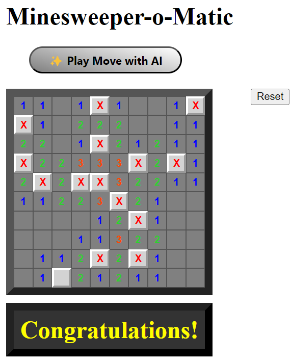

# Minesweeper-o-Matic

## What is it?

Minesweeper-o-Matic is an implementation of the classic [Minesweeper](https://freeminesweeper.org/) game written in Haskell using Threepenny UI. As well as allowing you to play Minesweeper, it also allows you to play moves automatically. 

## How to Play
This version of Minesweeper consists of a 10x10 grid containing 15 randomly distributed mines. 

The controls are very similar to that of classic Minesweeper:

- **Left click** on a square to reveal it,
- **Right click** on a square to flag/unflag it.

Note that revealing a square with no neighbouring mines will automatically reveal all of its neighbours. This allows large sections of the grid to open up quite quickly. 

In addition to this, there are two other buttons:

- **Reset**, which starts a new game,
- **Play Move**, which plays a move automatically.

DISCLAIMER: Despite what it says on the button, **Play Move** does _not_ use AI to calculate the next move. The best move is calculated programatically based on the current state of the grid, and prioritizes unambiguously safe moves before resorting to probability. 

The AI part is there to introduce uncertainty so that you can't sue me if it reveals a mine!

## How to Win
Just like classic Minesweeper, revealing a square that contains a mine will cause you to lose the game. 

You win the game by revealing every square that _isn't_ a mine. Note that this does not require that you _flag_ every mine, just that you don't _reveal_ any. 

## How to Run

If you want to run this project using stack, simply execute the command `stack run` inside the root folder (`Minesweeper-o-Matic/`). Opening up the url http://localhost:8023 will allow you to view and play the game!

## How it works

The project consists of three main modules (four if you count the CSS styles). These are:

- **The Main File** (sets up and runs the game),
- **The Minesweeper File** (contains all the logic for running a game of Minesweeper),
- **The Player File** (contains all the logic for making automatic moves).

### The Main File
This module runs the game by setting up a window with Threepenny UI, initializing the Grid and other UI elements and displaying these to the user.

The two important functions are:

- **setup**: Takes in the Game Window. Creates the Game and Reset button and runs the Game in the Window. Starts a new Game if the Reset button is clicked. 

- **createGame**: Takes in the Game Window. Returns a list of Elements wrapped in the UI Monad which contains the initialized Game, the Element that displays Wins/Losses and the Play Move button. Calls the **playMove** function when the Play Move button is clicked. 

### The Minesweeper File
This module contains all the necessary logic and functions for running and playing a game of Minesweeper. 

Each cell is represented using three different data types: 

- **Cell** -  which can be a *Mine* or *Empty with N neighbouring Mines*,
- **State** - which can be a *Hidden* or *Revealed* Cell,
- **Square** - which can be a *Flagged* or *Clear* (unflagged) State.

The **Square** data type is what is used throughout the rest of the program. 

The Grid consists of a 2D list of Squares, which is passed around from function to function so that it is kept up to date. Squares are also referenced by their coordinates in the Grid. All coordinates are in the form *(Row, Column)*. 

The most important functions defined in this file are:

- **createGrid**: Returns a 2D List of Squares wrapped in the IO Monad, initialized with 15 randomly placed mines and each Square's Clue (number of neighbouring mines).

- **updateSquare**: Takes in the 2D List of Squares wrapped in an IO Ref, the coordinates of the Square to update, and the new Square object to update it with. Updates the IO Ref with the new Square status.

- **mkButton**: Takes in the 2D List of Squares wrapped in an IO Ref, a Bool representing the Game State wrapped in an IO Ref, and the coordinates of the corresponding Square in the grid. Returns a tuple of Elements with a UI wrapper that represents the button itself and the div containing it. Describes the behaviour for Left and Right clicking. 

- **mkButtons**: Takes in Game Window, the 2D List of Squares wrapped in an IO Ref, a Bool representing the Game State wrapped in an IO Ref and an Element which displays Wins/Losses. Returns a list of Elements with a UI wrapper that consists of Button Grid and Win/Loss Display. Activates a separate thread for the **loop** function.

- **loop**: Takes in the 2D List of Buttons wrapped in an IO Ref, the 2D List of Squares wrapped in an IO Ref, a Bool representing the Game State wrapped in an IO Ref and an Element which displays Wins/Losses. Runs the **updateGrid** function every 0.1 seconds while the game is active.

- **updateGrid**: Takes in the 2D List of Buttons wrapped in an IO Ref, the 2D List of Squares wrapped in an IO Ref, a Bool representing the Game State wrapped in an IO Ref and an Element which displays Wins/Losses. Ensures that the Buttons are kept visually updated corresponding to their Square in the Grid. Checks for the Win/Lose conditions and ends the game if either is satisfied. 

### The Player File

This module contains all the functions and logic pertaining to the *Play Move* feature, which allows the user to automatically play the next move. 

As all of the functions within the file relate to this one feature, I will explain the logical flow of the main **playMove** function instead of going through each of the constituent functions individually. 

The **playMove** function takes in the Grid of Squares and Game State as parameters. If the game is active when this function is called, then it will perform the following checks:

1. First, the program will iterate through the grid to find **an unambiguously safe reveal move**.* This means finding a square in the grid whose number of flagged neighbours is equal to its clue, in which case the remaining hidden neighbours of that square can be safely revealed. One of these squares is then revealed by the function. 

*Note that this check assumes that all mines have been flagged correctly. The program will never flag an empty square on its own, so this reveal can only be unsafe if the user mis-flags a square. 

2. If no safe reveal move was found, the program will iterate through the Grid to find **an unambiguously safe flag move**.** This means finding a square in the grid whose number of unflagged hidden neighbours is equal to its clue (minus the number of flagged neighbours), in which case the remaining hidden neighbours can be safely flagged. One of these squares is then flagged by the function. 

**Again note that this check assumes that any existing flagged squares are correct. If the user makes a mistake with the flags then this function could flag a square incorrectly. 

3. If no safe flag move was found using the basic logic, the program will attempt to use advanced logic to flag a square. The program will iterate through the Grid to search for an instance of **the 1-2-X Pattern**, which can be used to perform **an unambiguously safe flag move**. The program employs the logic described [in this explanation of 1-2-X](https://minesweepergame.com/strategy/patterns.php) to find an instance of 1-2-X in any position or direction and flags the corresponding mine if the pattern is found. This program does not support the use of pattern reduction to reduce higher-numbered patterns down to 1-2-X. There is also an additional pattern, 1-1-X, that is described in the explanation linked above but a check for this is not implemented in this program. 

4. If all else fails, and no unambiguously safe reveal or flag move was found, the program will attempt to use probabilities to perform **the least dangerous reveal move.** The program iterates through the Grid and calculates the local probabilities of containing a mine for every unrevealed square based on the clues of any revealed neighbours (any squares without revealed neighbours are assigned a probability of 1 to indicate that they are the most dangerous, as we have no information about them). The squares are sorted in ascending order of probability and the head of this list is selected as the square to reveal. The probability of each square is calculated as the clue of its revealed neighbour divided by the total number of *that* neighbour's unrevealed neighbours (multiple probabilities in the case of several revealed neighbours are aggregated together). For instance, the probability of a square next to a revealed square with clue 1 and four other hidden neighbours containing a mine is 1/5 or 20%. 

The 4th check relies on local probabilities to select the least dangerous square to reveal, however this is not actually the best way to compute each square's probability of being a mine. [This discussion by Sean Barrett](https://nothings.org/games/minesweeper/) explains a better (though significantly more complex) way to calculate probabilities in Minesweeper. 

#### This Project was created as a Coursework Submission for CSU44012 - Topics in Functional Programming as part of the Trinity College Dublin Computer Science Degree Programme 2024/25.